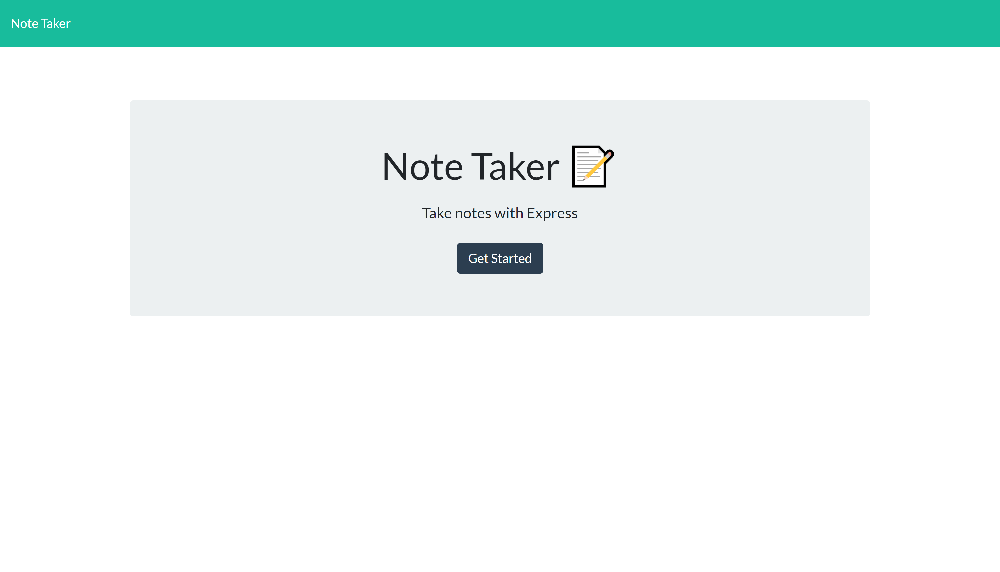
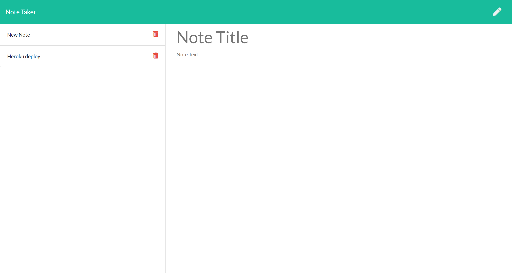
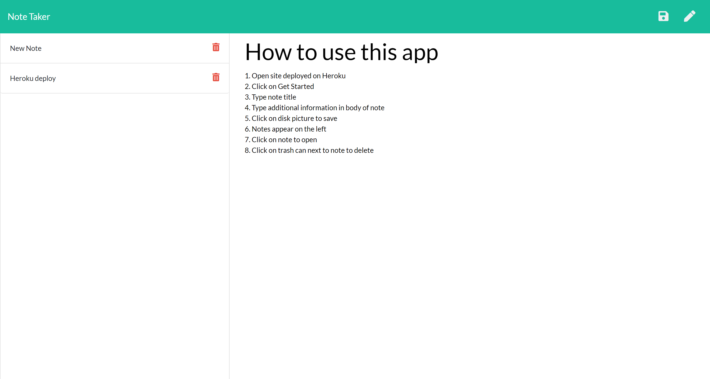
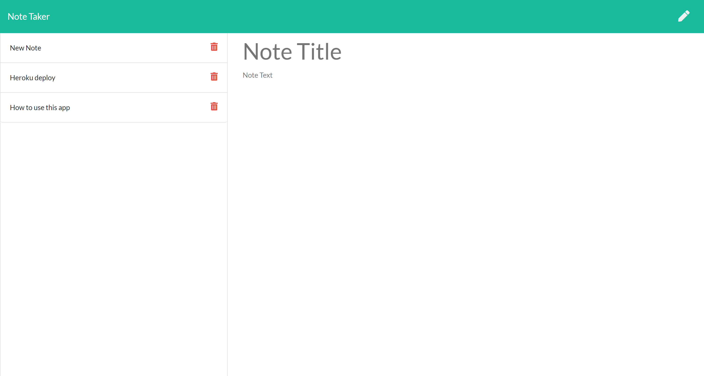

# NOTE TAKER

  
  
  ## Table of Contents
  - [Description](#description)
  - [Installation](#installation)
  - [Usage](#usage)
  - [Contributing](#contributing)
  - [Questions](#questions)
  - [License](#license)

  ### Description
 This app enables the user to write notes, save them for future use, or delete them.  The app incorporates HTML and Javascript on the front end and Express for the back end, then deployed to Heroku for full access.
  
  ### Installation
  Simply go to [Note Taker App](https://calm-bastion-49456.herokuapp.com/) hosted by Heroku.
  
  ### Usage
  Upon accessing the web page, the user will see the home page.  Simply click on Get Started to create the first note.
   
  Upon reaching the notes page, click in the main body of the note and type in your own text for the Note Heading and Note Body Text.  
  Click on the disk icon in the upper right-hand corner, and the note will be saved to the list on the left side of the page. 
  To delete, click on the trash can to the right side of the note.
  
  ### Contributions
  I had a lot of help on this assignment.  Special thanks to Pete Kriengsiri for help with the static files and making sure the get * path goes last.  My tutor was a big help working through the different folders and separating the routes into their own files.  Also, I found a great tutorial on the .filter technique to use for my delete route at [javascript tutorial](https://www.javascripttutorial.net/javascript-array-filter/).
  
  ### Questions
  For questions, please check out my [GitHub](https://github.com/jacquie24) page first.  If you have any further questions, you can email me directly at jgcaption@yahoo.com.
  
  ### License
  This page uses the [MIT](https://choosealicense.com/licenses/mit/) license.
